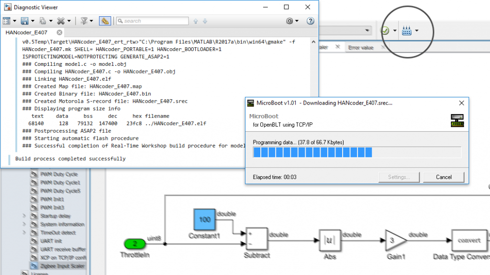

**HANcoder**

HANcoder STM32 Target is part of the open model based development (openMBD)
suite created by HAN Automotive Research.

HANcoder is a family of real-time code generation targets for MATLAB Simulink(R).
HANcoder supports both automotive grade series production controllers as well
as some low-cost development boards. The support for low-cost controllers as
well as production grade controllers provide users a unique possibility to
start desktop/laboratory prototyping with low-cost controllers and step up to 
production grade prototypes as well as series production solutions with little
effort, thanks to the compatible HANcoder libraries for supported controllers. 

HANcoder STM32 Target supports three low-cost STM32 based boards from Olimex.

Targets from HANcoder represent itself as a library in Simulink(R). By using
blocks from this library, the user can connect a MATLAB Simulink(R) model to
inputs and outputs of the controller. The inputs and outputs are represented by
dedicated Simulink(R) blocks. The behavior of the inputs and outputs can be
changed by adapting the appropriate block parameters. System configuration
can also be easily performed by system configuration blocks.

Generating code is as easy as a click of a button. The fully automated process
of code generation results in a so-called hex file or S-record file. This file
contains the executable code. It can be flashed into the target controller
hardware. After flashing, the controller will automatically execute the
algorithm when it is switched on.

**LICENSE**

MIT License

Copyright (c) 2019 HAN University of Applied Sciences - Automotive Research

Permission is hereby granted, free of charge, to any person obtaining a copy
of this software and associated documentation files (the "Software"), to deal
in the Software without restriction, including without limitation the rights
to use, copy, modify, merge, publish, distribute, sublicense, and/or sell
copies of the Software, and to permit persons to whom the Software is
furnished to do so, subject to the following conditions:

The above copyright notice and this permission notice shall be included in all
copies or substantial portions of the Software.

THE SOFTWARE IS PROVIDED "AS IS", WITHOUT WARRANTY OF ANY KIND, EXPRESS OR
IMPLIED, INCLUDING BUT NOT LIMITED TO THE WARRANTIES OF MERCHANTABILITY,
FITNESS FOR A PARTICULAR PURPOSE AND NONINFRINGEMENT. IN NO EVENT SHALL THE
AUTHORS OR COPYRIGHT HOLDERS BE LIABLE FOR ANY CLAIM, DAMAGES OR OTHER
LIABILITY, WHETHER IN AN ACTION OF CONTRACT, TORT OR OTHERWISE, ARISING FROM,
OUT OF OR IN CONNECTION WITH THE SOFTWARE OR THE USE OR OTHER DEALINGS IN THE
SOFTWARE.

**Third Party Acknowledgements**

HANcoder STM32 Target uses the the third party software components as mentioned
in the file VERSION_LICENSE_2019-10-31_150525.txt.

**DISCLAIMER**

HAN University of Applied Sciences (hereafter: "HAN") has deliberately chosen 
to publish HANcoder in open source. The reason for using open source is that
HAN wants to contribute to innovation and development. HAN believes it is
important to share knowledge and give others the opportunity to use HANcoder
as a starting point for further developments. Because it is open source and
controlled by the community, HAN does not control the source code nor its
quality. Use HANcoder on your own risk. HANcoder is made available under the
MIT license. Please note that this license contains an exclusion of liability.

**Documentation**

HANcoder documentation is available here:
http://openmbd.com/

***Getting started***

http://openmbd.com/getting-started/

***Wiki***

http://openmbd.com/wiki/HANcoder
   
***Installation***

http://openmbd.com/wiki/HANcoder/STM32/Installation_Manual

**Quick guide**
HANcoder STM32 Target comes with a MATLAB Simulink(R) template model for each 
supported STM32 board.

1. Place the complete HANcoder STM32 Target directory in a desired location on
   your computer.

2. Open the template model in MATLAB Simulink(R) by double clicking the 
   appropriate .slx file for the board of your choice, assuming MATLAB Simulink(R)
   is installed:
   -  HANcoder_Olimexino.slx for the Olimexino-STM32 board
   -  HANcoder_Olimexino_F3.slx for the Olimexino-STM32-F3 board
   -  HANcoder_E407.slx for the Olimex STM32-E407 board
   -  HANcoder_P405.slx for the Olimex STM32-P405 board
   
3. Build the model in Simulink (CTRL+b). Note: Make sure that the current folder
   in MATLAB is the folder that contains the Simulink model to build.

4. Flash the generated s-record file in the STM32 board.
   Three options are supported:

    a. Using an ST-Link/V2
       Purchase an ST-LINK/V2 programmer and download the PC application for
	   programming here: https://www.st.com/en/development-tools/st-link-v2.html
       
    b. OpenBLT bootloader version 1.0.1 from Feaser (https://www.feaser.com).
       The OpenBLT bootloader binaries v1.0.1 are available for downloaded from
	   openMBD.com:
       http://openmbd.com/wiki/Downloads/HANcoder#OpenBLT_binaries_.2804-11-2019.29
       Installation and usage of the binaries is described on openMBD.com:
       http://openmbd.com/wiki/HANcoder/STM32/Installation_Manual
	   
    c. STM32CubeProgrammer can be used to program the **Olimexino-STM32-F3 board**.
	   The programmer can be downloaded as a complete package st.com:
	   https://www.st.com/en/development-tools/stm32cubeprog.html
	   Installation and usage of the binaries is described on openMBD.com:
	
**Contact**
  
For more information contact jan.benders@han.nl